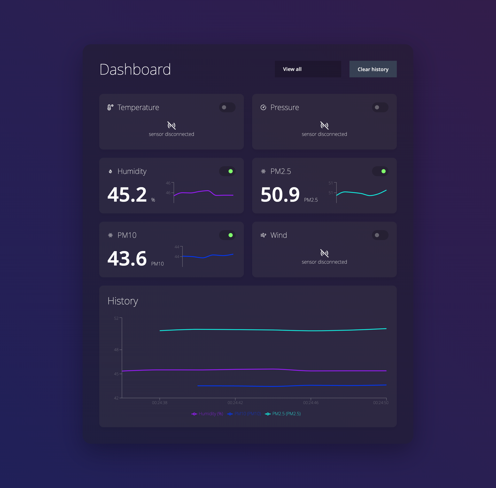

# Sensors Dashboard - React + TS + Redux + WebSocket 

Implementation of a React application Connected to a websocket server displaying live information from multiple sensors.
This implementation redux connected to an api client service responsible to connect with the websocket server that provided the live sensor feed.

Run this project using - `npm ci && cpm start`

